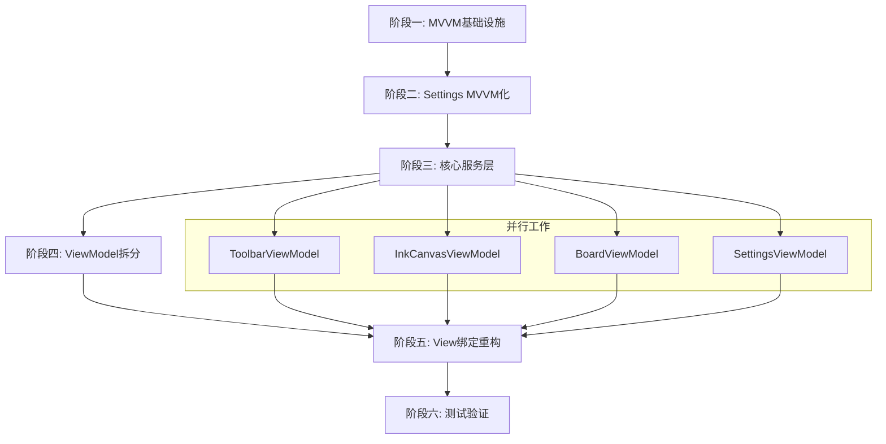

# MainWindow MVVM 架构重构计划

## 📋 概述

本计划旨在将 InkCanvasForClass 的 MainWindow 从当前的 code-behind 模式重构为 MVVM 架构，实现 UI 与业务逻辑的分离，提高代码的可测试性和可维护性。

## 🎯 重构目标

1. **关注点分离** - 将 UI 逻辑与业务逻辑分离
2. **可测试性** - 使业务逻辑可以进行单元测试
3. **可维护性** - 降低代码耦合度，提高可维护性
4. **渐进式迁移** - 不破坏现有功能，逐步完成重构

## 📊 当前状态分析

### 项目技术栈
- **框架**: .NET 8.0 (net8.0-windows10.0.17763.0)
- **UI框架**: WPF + iNKORE.UI.WPF.Modern
- **序列化**: Newtonsoft.Json
- **当前MVVM支持**: 无

### 当前架构问题

```
┌─────────────────────────────────────────────────────────────┐
│                     MainWindow.xaml                          │
│  ┌─────────────────────────────────────────────────────┐   │
│  │              MainWindow.xaml.cs                      │   │
│  │  ┌─────────────────────────────────────────────────┐│   │
│  │  │  28个 Partial Class 文件                        ││   │
│  │  │  MW_Settings.cs (12万+字符)                    ││   │
│  │  │  MW_TouchEvents.cs                              ││   │
│  │  │  MW_ShapeDrawing.cs                            ││   │
│  │  │  ... 等等                                       ││   │
│  │  │                                                 ││   │
│  │  │  ┌───────────────┐  ┌──────────────────┐      ││   │
│  │  │  │ UI逻辑        │  │ 业务逻辑          │      ││   │
│  │  │  │ 事件处理      │  │ Settings管理      │      ││   │
│  │  │  │ 动画控制      │  │ 文件操作          │      ││   │
│  │  │  └───────────────┘  └──────────────────┘      ││   │
│  │  └─────────────────────────────────────────────────┘│   │
│  └─────────────────────────────────────────────────────┘   │
└─────────────────────────────────────────────────────────────┘
```

**问题清单**:
1. ❌ 所有逻辑都在 code-behind 中
2. ❌ Settings 类没有实现 `INotifyPropertyChanged`
3. ❌ UI 和业务逻辑紧密耦合
4. ❌ 难以进行单元测试
5. ❌ 28个 partial class 文件使代码难以导航

## 🏗️ 目标架构

```
┌─────────────────────────────────────────────────────────────────┐
│                          Views                                   │
│  ┌─────────────────┐  ┌─────────────────┐  ┌─────────────────┐ │
│  │ MainWindow.xaml │  │  Popups/*.xaml  │  │  Controls/*.xaml│ │
│  └────────┬────────┘  └────────┬────────┘  └────────┬────────┘ │
│           │                    │                    │           │
│           └────────────────────┴────────────────────┘           │
│                               │ Data Binding                    │
│                               ▼                                  │
│  ┌─────────────────────────────────────────────────────────────┐│
│  │                      ViewModels                              ││
│  │  ┌──────────────────┐  ┌──────────────────┐                ││
│  │  │MainWindowViewModel│  │SettingsViewModel │                ││
│  │  └────────┬─────────┘  └────────┬─────────┘                ││
│  │           │                     │                           ││
│  │  ┌────────┴─────────────────────┴────────┐                 ││
│  │  │         Sub-ViewModels                 │                 ││
│  │  │  ┌─────────────┐  ┌─────────────────┐ │                 ││
│  │  │  │InkCanvasVM  │  │ToolbarViewModel │ │                 ││
│  │  │  │BoardVM      │  │TimerViewModel   │ │                 ││
│  │  │  │GestureVM    │  │PPTViewModel     │ │                 ││
│  │  │  └─────────────┘  └─────────────────┘ │                 ││
│  │  └───────────────────────────────────────┘                 ││
│  └─────────────────────────────────────────────────────────────┘│
│                               │                                  │
│                               ▼                                  │
│  ┌─────────────────────────────────────────────────────────────┐│
│  │                       Services                               ││
│  │  ┌──────────────┐ ┌──────────────┐ ┌──────────────────────┐││
│  │  │SettingsService│ │InkService   │ │ShapeDrawingService   │││
│  │  │StorageService │ │GestureService│ │PPTService           │││
│  │  │HotkeyService  │ │EraserService│ │ScreenshotService    │││
│  │  └──────────────┘ └──────────────┘ └──────────────────────┘││
│  └─────────────────────────────────────────────────────────────┘│
│                               │                                  │
│                               ▼                                  │
│  ┌─────────────────────────────────────────────────────────────┐│
│  │                        Models                                ││
│  │  ┌──────────────┐ ┌──────────────┐ ┌──────────────────────┐││
│  │  │ Settings     │ │ StrokeData   │ │ BoardPage            │││
│  │  │ CanvasState  │ │ ShapeConfig  │ │ TimerState          │││
│  │  └──────────────┘ └──────────────┘ └──────────────────────┘││
│  └─────────────────────────────────────────────────────────────┘│
└─────────────────────────────────────────────────────────────────┘
```

---

## 📁 目录结构规划

```
InkCanvasForClass/
├── App.xaml
├── App.xaml.cs
├── MainWindow.xaml
├── MainWindow.xaml.cs          # 简化后的code-behind
│
├── Core/                        # MVVM核心基础设施
│   ├── ViewModelBase.cs        # ViewModel基类
│   ├── RelayCommand.cs         # 命令实现（如果不用Toolkit）
│   ├── ObservableObject.cs     # 可观察对象基类
│   └── ServiceLocator.cs       # 服务定位器/DI容器
│
├── Models/                      # 数据模型
│   ├── Settings/               # Settings相关模型
│   │   ├── SettingsModel.cs    # 主设置模型（Observable版本）
│   │   ├── AppearanceSettings.cs
│   │   ├── CanvasSettings.cs
│   │   ├── GestureSettings.cs
│   │   ├── StartupSettings.cs
│   │   ├── PowerPointSettings.cs
│   │   ├── AutomationSettings.cs
│   │   └── AdvancedSettings.cs
│   ├── CanvasState.cs          # 画布状态
│   ├── BoardPage.cs            # 白板页面
│   └── StrokeData.cs           # 笔迹数据
│
├── ViewModels/                  # ViewModel层
│   ├── MainWindowViewModel.cs  # 主窗口ViewModel
│   ├── SettingsViewModel.cs    # 设置页ViewModel
│   ├── ToolbarViewModel.cs     # 工具栏ViewModel
│   ├── InkCanvasViewModel.cs   # 画布ViewModel
│   ├── BoardViewModel.cs       # 白板ViewModel
│   ├── GestureViewModel.cs     # 手势ViewModel
│   ├── TimerViewModel.cs       # 计时器ViewModel
│   └── PPTViewModel.cs         # PPT支持ViewModel
│
├── Services/                    # 服务层
│   ├── Interfaces/             # 服务接口
│   │   ├── ISettingsService.cs
│   │   ├── IStorageService.cs
│   │   ├── IInkService.cs
│   │   ├── IGestureService.cs
│   │   ├── IHotkeyService.cs
│   │   ├── IShapeDrawingService.cs
│   │   ├── IPPTService.cs
│   │   └── IScreenshotService.cs
│   ├── SettingsService.cs      # 设置服务实现
│   ├── StorageService.cs       # 存储服务实现
│   ├── InkService.cs           # 墨迹服务实现
│   ├── GestureService.cs       # 手势服务实现
│   ├── HotkeyService.cs        # 热键服务实现
│   └── ScreenshotService.cs    # 截图服务实现
│
├── Controls/                    # 自定义控件
│   ├── IccInkCanvas.cs         # 从MW_InkCanvas.cs提取
│   └── IccStroke.cs            # 从MW_InkCanvas.cs提取
│
├── Converters/                  # 值转换器
│   ├── BoolToVisibilityConverter.cs
│   ├── ColorToBrushConverter.cs
│   └── EnumToDescriptionConverter.cs
│
├── Helpers/                     # 保留现有helpers
│   └── ...
│
├── ShapeDrawing/               # 已重构的形状绘制模块
│   └── ...
│
└── Resources/                  # 资源文件
    └── ...
```

---

## 🚀 实施阶段

### 阶段一：MVVM 基础设施搭建

**目标**: 添加 MVVM 框架支持和基础设施

#### 1.1 添加 NuGet 包

```xml
<!-- 在 InkCanvasForClass.csproj 中添加 -->
<PackageReference Include="CommunityToolkit.Mvvm" Version="8.2.2" />
```

**CommunityToolkit.Mvvm 提供的功能**:
- `ObservableObject` - 实现 `INotifyPropertyChanged`
- `RelayCommand` / `AsyncRelayCommand` - 命令实现
- `[ObservableProperty]` - 属性源生成器
- `[RelayCommand]` - 命令源生成器
- `Messenger` - 消息机制

#### 1.2 创建 MVVM 核心文件

**ViewModelBase.cs**:
```csharp
using CommunityToolkit.Mvvm.ComponentModel;
using CommunityToolkit.Mvvm.Input;

namespace Ink_Canvas.Core
{
    /// <summary>
    /// 所有ViewModel的基类
    /// </summary>
    public abstract partial class ViewModelBase : ObservableObject
    {
        [ObservableProperty]
        private bool _isBusy;

        [ObservableProperty]
        private string _title;

        /// <summary>
        /// 初始化ViewModel
        /// </summary>
        public virtual void Initialize() { }

        /// <summary>
        /// 清理ViewModel资源
        /// </summary>
        public virtual void Cleanup() { }
    }
}
```

**ServiceLocator.cs**:
```csharp
using Microsoft.Extensions.DependencyInjection;
using System;

namespace Ink_Canvas.Core
{
    /// <summary>
    /// 简单的服务定位器，用于依赖注入
    /// </summary>
    public static class ServiceLocator
    {
        private static IServiceProvider _serviceProvider;

        public static IServiceProvider ServiceProvider
        {
            get => _serviceProvider;
            set => _serviceProvider = value ?? throw new ArgumentNullException(nameof(value));
        }

        public static T GetService<T>() where T : class
        {
            return _serviceProvider?.GetService<T>();
        }

        public static T GetRequiredService<T>() where T : class
        {
            return _serviceProvider?.GetRequiredService<T>();
        }
    }
}
```

#### 1.3 修改 App.xaml.cs 配置 DI

```csharp
using Microsoft.Extensions.DependencyInjection;

public partial class App : Application
{
    private IServiceProvider _serviceProvider;

    private void ConfigureServices(IServiceCollection services)
    {
        // 注册Services
        services.AddSingleton<ISettingsService, SettingsService>();
        services.AddSingleton<IStorageService, StorageService>();
        services.AddSingleton<IInkService, InkService>();
        services.AddSingleton<IGestureService, GestureService>();
        services.AddSingleton<IHotkeyService, HotkeyService>();
        
        // 注册ViewModels
        services.AddSingleton<MainWindowViewModel>();
        services.AddTransient<SettingsViewModel>();
        services.AddTransient<ToolbarViewModel>();
        
        // 注册Views
        services.AddSingleton<MainWindow>();
    }

    void App_Startup(object sender, StartupEventArgs e)
    {
        var services = new ServiceCollection();
        ConfigureServices(services);
        _serviceProvider = services.BuildServiceProvider();
        ServiceLocator.ServiceProvider = _serviceProvider;
        
        // ... 其余启动代码
    }
}
```

---

### 阶段二：Settings 系统 MVVM 化

**目标**: 将现有的 Settings POCO 类转换为支持 `INotifyPropertyChanged` 的 Observable 类

#### 2.1 创建 Observable Settings 模型

**Models/Settings/CanvasSettingsModel.cs** (示例):
```csharp
using CommunityToolkit.Mvvm.ComponentModel;
using Newtonsoft.Json;

namespace Ink_Canvas.Models.Settings
{
    public partial class CanvasSettingsModel : ObservableObject
    {
        [ObservableProperty]
        [JsonProperty("inkWidth")]
        private double _inkWidth = 2.5;

        [ObservableProperty]
        [JsonProperty("highlighterWidth")]
        private double _highlighterWidth = 20;

        [ObservableProperty]
        [JsonProperty("inkAlpha")]
        private double _inkAlpha = 255;

        [ObservableProperty]
        [JsonProperty("isShowCursor")]
        private bool _isShowCursor = false;

        [ObservableProperty]
        [JsonProperty("fitToCurve")]
        private bool _fitToCurve = true;

        [ObservableProperty]
        [JsonProperty("eraserSize")]
        private int _eraserSize = 2;

        [ObservableProperty]
        [JsonProperty("eraserType")]
        private int _eraserType = 0;

        [ObservableProperty]
        [JsonProperty("eraserShapeType")]
        private int _eraserShapeType = 0;
        
        // ... 其他属性
    }
}
```

**Models/Settings/SettingsModel.cs**:
```csharp
using CommunityToolkit.Mvvm.ComponentModel;
using Newtonsoft.Json;

namespace Ink_Canvas.Models.Settings
{
    public partial class SettingsModel : ObservableObject
    {
        [ObservableProperty]
        [JsonProperty("advanced")]
        private AdvancedSettingsModel _advanced = new();

        [ObservableProperty]
        [JsonProperty("appearance")]
        private AppearanceSettingsModel _appearance = new();

        [ObservableProperty]
        [JsonProperty("canvas")]
        private CanvasSettingsModel _canvas = new();

        [ObservableProperty]
        [JsonProperty("gesture")]
        private GestureSettingsModel _gesture = new();

        [ObservableProperty]
        [JsonProperty("startup")]
        private StartupSettingsModel _startup = new();

        [ObservableProperty]
        [JsonProperty("behavior")]
        private PowerPointSettingsModel _powerPointSettings = new();

        // ... 其他设置组
    }
}
```

#### 2.2 创建 ISettingsService 接口

```csharp
namespace Ink_Canvas.Services.Interfaces
{
    public interface ISettingsService
    {
        /// <summary>
        /// 当前设置
        /// </summary>
        SettingsModel Settings { get; }

        /// <summary>
        /// 从文件加载设置
        /// </summary>
        Task LoadSettingsAsync();

        /// <summary>
        /// 保存设置到文件
        /// </summary>
        Task SaveSettingsAsync();

        /// <summary>
        /// 重置为默认设置
        /// </summary>
        void ResetToDefaults();

        /// <summary>
        /// 设置变更事件
        /// </summary>
        event EventHandler<SettingsChangedEventArgs> SettingsChanged;
    }
}
```

#### 2.3 实现 SettingsService

```csharp
using Newtonsoft.Json;
using System.ComponentModel;

namespace Ink_Canvas.Services
{
    public class SettingsService : ISettingsService, INotifyPropertyChanged
    {
        private readonly string _settingsFilePath;
        private SettingsModel _settings;
        private bool _isDirty = false;
        private readonly object _saveLock = new object();

        public SettingsModel Settings
        {
            get => _settings;
            private set
            {
                _settings = value;
                PropertyChanged?.Invoke(this, new PropertyChangedEventArgs(nameof(Settings)));
            }
        }

        public event EventHandler<SettingsChangedEventArgs> SettingsChanged;
        public event PropertyChangedEventHandler PropertyChanged;

        public SettingsService()
        {
            _settingsFilePath = Path.Combine(App.RootPath, "Settings.json");
            _settings = new SettingsModel();
            
            // 监听设置变更
            SubscribeToSettingsChanges();
        }

        private void SubscribeToSettingsChanges()
        {
            // 递归订阅所有子设置的PropertyChanged
            Settings.PropertyChanged += OnSettingsPropertyChanged;
            Settings.Canvas.PropertyChanged += OnSettingsPropertyChanged;
            Settings.Appearance.PropertyChanged += OnSettingsPropertyChanged;
            // ... 其他子设置
        }

        private void OnSettingsPropertyChanged(object sender, PropertyChangedEventArgs e)
        {
            _isDirty = true;
            SettingsChanged?.Invoke(this, new SettingsChangedEventArgs(e.PropertyName));
            
            // 防抖保存
            DebounceAndSave();
        }

        private CancellationTokenSource _saveCts;
        private async void DebounceAndSave()
        {
            _saveCts?.Cancel();
            _saveCts = new CancellationTokenSource();
            
            try
            {
                await Task.Delay(500, _saveCts.Token);
                await SaveSettingsAsync();
            }
            catch (TaskCanceledException) { }
        }

        public async Task LoadSettingsAsync()
        {
            try
            {
                if (File.Exists(_settingsFilePath))
                {
                    var json = await File.ReadAllTextAsync(_settingsFilePath);
                    var loadedSettings = JsonConvert.DeserializeObject<SettingsModel>(json);
                    if (loadedSettings != null)
                    {
                        Settings = loadedSettings;
                        SubscribeToSettingsChanges();
                    }
                }
            }
            catch (Exception ex)
            {
                LogHelper.WriteLogToFile($"Failed to load settings: {ex.Message}", LogHelper.LogType.Error);
            }
        }

        public async Task SaveSettingsAsync()
        {
            if (!_isDirty) return;

            lock (_saveLock)
            {
                try
                {
                    var json = JsonConvert.SerializeObject(Settings, Formatting.Indented);
                    File.WriteAllText(_settingsFilePath, json);
                    _isDirty = false;
                }
                catch (Exception ex)
                {
                    LogHelper.WriteLogToFile($"Failed to save settings: {ex.Message}", LogHelper.LogType.Error);
                }
            }
        }

        public void ResetToDefaults()
        {
            Settings = new SettingsModel();
            SubscribeToSettingsChanges();
            _isDirty = true;
        }
    }
}
```

---

### 阶段三：创建核心服务层

**目标**: 将业务逻辑从 MainWindow 提取到独立的服务类

#### 3.1 服务接口定义

```csharp
// IInkService.cs
public interface IInkService
{
    InkCanvas InkCanvas { get; set; }
    StrokeCollection CurrentStrokes { get; }
    DrawingAttributes CurrentDrawingAttributes { get; set; }
    
    void Clear();
    void Undo();
    void Redo();
    void SetPenMode();
    void SetEraserMode(EraserType type);
    void SetSelectionMode();
}

// IGestureService.cs
public interface IGestureService
{
    bool IsMultiTouchEnabled { get; set; }
    bool IsTwoFingerGestureEnabled { get; set; }
    
    void ProcessTouchDown(TouchEventArgs e);
    void ProcessTouchMove(TouchEventArgs e);
    void ProcessTouchUp(TouchEventArgs e);
    
    event EventHandler<GestureEventArgs> GestureRecognized;
}

// IHotkeyService.cs
public interface IHotkeyService
{
    void RegisterHotkey(string name, KeyGesture gesture, Action callback);
    void UnregisterHotkey(string name);
    void EnableAllHotkeys();
    void DisableAllHotkeys();
}
```

#### 3.2 服务实现示例

**InkService.cs**:
```csharp
public class InkService : IInkService
{
    private readonly ISettingsService _settingsService;
    private readonly TimeMachine _timeMachine;

    public InkCanvas InkCanvas { get; set; }
    public StrokeCollection CurrentStrokes => InkCanvas?.Strokes;
    
    public DrawingAttributes CurrentDrawingAttributes
    {
        get => InkCanvas?.DefaultDrawingAttributes;
        set
        {
            if (InkCanvas != null)
                InkCanvas.DefaultDrawingAttributes = value;
        }
    }

    public InkService(ISettingsService settingsService)
    {
        _settingsService = settingsService;
        _timeMachine = new TimeMachine();
    }

    public void Clear()
    {
        if (InkCanvas?.Strokes != null)
        {
            _timeMachine.CommitStrokeEraseHistory(InkCanvas.Strokes.ToList());
            InkCanvas.Strokes.Clear();
        }
    }

    public void Undo()
    {
        var action = _timeMachine.Undo();
        ApplyTimeMachineAction(action);
    }

    public void Redo()
    {
        var action = _timeMachine.Redo();
        ApplyTimeMachineAction(action);
    }

    private void ApplyTimeMachineAction(TimeMachineAction action)
    {
        // 应用时间机器操作
    }

    public void SetPenMode()
    {
        if (InkCanvas != null)
            InkCanvas.EditingMode = InkCanvasEditingMode.Ink;
    }

    public void SetEraserMode(EraserType type)
    {
        if (InkCanvas != null)
        {
            InkCanvas.EditingMode = type == EraserType.Stroke 
                ? InkCanvasEditingMode.EraseByStroke 
                : InkCanvasEditingMode.EraseByPoint;
        }
    }

    public void SetSelectionMode()
    {
        if (InkCanvas != null)
            InkCanvas.EditingMode = InkCanvasEditingMode.Select;
    }
}
```

---

### 阶段四：MainWindow ViewModel 拆分

**目标**: 创建 MainWindowViewModel 及子 ViewModel，逐步迁移逻辑

#### 4.1 MainWindowViewModel

```csharp
using CommunityToolkit.Mvvm.ComponentModel;
using CommunityToolkit.Mvvm.Input;

namespace Ink_Canvas.ViewModels
{
    public partial class MainWindowViewModel : ViewModelBase
    {
        private readonly ISettingsService _settingsService;
        private readonly IInkService _inkService;
        private readonly IGestureService _gestureService;
        private readonly IHotkeyService _hotkeyService;

        // 子ViewModel
        public ToolbarViewModel Toolbar { get; }
        public InkCanvasViewModel InkCanvas { get; }
        public BoardViewModel Board { get; }
        public SettingsViewModel Settings { get; }

        // 应用状态
        [ObservableProperty]
        private bool _isLoaded;

        [ObservableProperty]
        private int _currentMode; // 0=桌面模式, 1=白板模式

        [ObservableProperty]
        private bool _isFloatingBarFolded;

        [ObservableProperty]
        private bool _isInPPTMode;

        public MainWindowViewModel(
            ISettingsService settingsService,
            IInkService inkService,
            IGestureService gestureService,
            IHotkeyService hotkeyService)
        {
            _settingsService = settingsService;
            _inkService = inkService;
            _gestureService = gestureService;
            _hotkeyService = hotkeyService;

            // 初始化子ViewModel
            Toolbar = new ToolbarViewModel(inkService, settingsService);
            InkCanvas = new InkCanvasViewModel(inkService, gestureService);
            Board = new BoardViewModel(inkService, settingsService);
            Settings = new SettingsViewModel(settingsService);
        }

        public override async void Initialize()
        {
            await _settingsService.LoadSettingsAsync();
            RegisterHotkeys();
            IsLoaded = true;
        }

        private void RegisterHotkeys()
        {
            _hotkeyService.RegisterHotkey("ToggleFold", 
                new KeyGesture(Key.S, ModifierKeys.Control), 
                () => IsFloatingBarFolded = !IsFloatingBarFolded);
            
            _hotkeyService.RegisterHotkey("SwitchMode", 
                new KeyGesture(Key.Tab, ModifierKeys.Control), 
                SwitchMode);
        }

        [RelayCommand]
        private void SwitchMode()
        {
            CurrentMode = CurrentMode == 0 ? 1 : 0;
        }

        [RelayCommand]
        private void Exit()
        {
            _settingsService.SaveSettingsAsync();
            Application.Current.Shutdown();
        }
    }
}
```

#### 4.2 ToolbarViewModel

```csharp
public partial class ToolbarViewModel : ViewModelBase
{
    private readonly IInkService _inkService;
    private readonly ISettingsService _settingsService;

    [ObservableProperty]
    private ToolType _currentTool = ToolType.Pen;

    [ObservableProperty]
    private Color _currentColor = Colors.Black;

    [ObservableProperty]
    private double _strokeWidth = 2.5;

    [ObservableProperty]
    private bool _isHighlighter;

    public ToolbarViewModel(IInkService inkService, ISettingsService settingsService)
    {
        _inkService = inkService;
        _settingsService = settingsService;

        // 从设置同步初始值
        StrokeWidth = _settingsService.Settings.Canvas.InkWidth;
    }

    partial void OnCurrentToolChanged(ToolType value)
    {
        switch (value)
        {
            case ToolType.Pen:
                _inkService.SetPenMode();
                break;
            case ToolType.Eraser:
                _inkService.SetEraserMode(EraserType.Point);
                break;
            case ToolType.Selection:
                _inkService.SetSelectionMode();
                break;
        }
    }

    partial void OnStrokeWidthChanged(double value)
    {
        _settingsService.Settings.Canvas.InkWidth = value;
        UpdateDrawingAttributes();
    }

    [RelayCommand]
    private void Clear()
    {
        _inkService.Clear();
    }

    [RelayCommand]
    private void Undo()
    {
        _inkService.Undo();
    }

    [RelayCommand]
    private void Redo()
    {
        _inkService.Redo();
    }

    private void UpdateDrawingAttributes()
    {
        var attrs = _inkService.CurrentDrawingAttributes;
        if (attrs != null)
        {
            attrs.Width = StrokeWidth;
            attrs.Height = StrokeWidth;
            attrs.Color = CurrentColor;
            attrs.IsHighlighter = IsHighlighter;
        }
    }
}

public enum ToolType
{
    Pen,
    Highlighter,
    Eraser,
    Selection,
    Shape
}
```

---

### 阶段五：View 层绑定重构

**目标**: 修改 XAML 使用数据绑定连接 ViewModel

#### 5.1 MainWindow.xaml 修改示例

```xml
<Window x:Class="Ink_Canvas.MainWindow"
        xmlns="http://schemas.microsoft.com/winfx/2006/xaml/presentation"
        xmlns:x="http://schemas.microsoft.com/winfx/2006/xaml"
        xmlns:vm="clr-namespace:Ink_Canvas.ViewModels"
        xmlns:d="http://schemas.microsoft.com/expression/blend/2008"
        xmlns:mc="http://schemas.openxmlformats.org/markup-compatibility/2006"
        d:DataContext="{d:DesignInstance Type=vm:MainWindowViewModel}"
        mc:Ignorable="d">
    
    <Window.DataContext>
        <!-- ViewModel 将在 code-behind 中设置，或通过 DI 注入 -->
    </Window.DataContext>
    
    <Grid>
        <!-- 工具栏绑定示例 -->
        <StackPanel DataContext="{Binding Toolbar}">
            <Button Command="{Binding ClearCommand}" Content="清除"/>
            <Button Command="{Binding UndoCommand}" Content="撤销"/>
            <Button Command="{Binding RedoCommand}" Content="重做"/>
            
            <!-- 笔宽滑块 -->
            <Slider Value="{Binding StrokeWidth, Mode=TwoWay}"
                    Minimum="1" Maximum="20"/>
            
            <!-- 颜色选择 -->
            <ItemsControl ItemsSource="{Binding AvailableColors}">
                <ItemsControl.ItemTemplate>
                    <DataTemplate>
                        <Button Command="{Binding DataContext.SelectColorCommand,
                                         RelativeSource={RelativeSource AncestorType=ItemsControl}}"
                                CommandParameter="{Binding}"
                                Background="{Binding Converter={StaticResource ColorToBrushConverter}}"/>
                    </DataTemplate>
                </ItemsControl.ItemTemplate>
            </ItemsControl>
        </StackPanel>
        
        <!-- 设置面板可见性绑定 -->
        <Grid Visibility="{Binding IsSettingsPanelVisible,
                          Converter={StaticResource BoolToVisibilityConverter}}">
            <!-- 设置内容 -->
        </Grid>
    </Grid>
</Window>
```

#### 5.2 MainWindow.xaml.cs 简化

```csharp
public partial class MainWindow : Window
{
    private readonly MainWindowViewModel _viewModel;

    public MainWindow(MainWindowViewModel viewModel)
    {
        InitializeComponent();
        _viewModel = viewModel;
        DataContext = _viewModel;
        
        Loaded += MainWindow_Loaded;
        Closing += MainWindow_Closing;
    }

    private void MainWindow_Loaded(object sender, RoutedEventArgs e)
    {
        _viewModel.Initialize();
        
        // 仅保留必须在 code-behind 处理的 UI 逻辑
        // 如窗口位置、特殊的 InkCanvas 事件等
    }

    private void MainWindow_Closing(object sender, CancelEventArgs e)
    {
        _viewModel.Cleanup();
    }

    // 保留一些必须在 code-behind 处理的事件
    // 如复杂的触摸事件、InkCanvas 特殊事件等
    private void inkCanvas_StrokeCollected(object sender, InkCanvasStrokeCollectedEventArgs e)
    {
        // 这类事件可以通过行为或附加属性转发到 ViewModel
    }
}
```

#### 5.3 创建常用转换器

**Converters/BoolToVisibilityConverter.cs**:
```csharp
public class BoolToVisibilityConverter : IValueConverter
{
    public object Convert(object value, Type targetType, object parameter, CultureInfo culture)
    {
        bool invert = parameter?.ToString() == "Invert";
        bool boolValue = value is bool b && b;
        
        if (invert) boolValue = !boolValue;
        
        return boolValue ? Visibility.Visible : Visibility.Collapsed;
    }

    public object ConvertBack(object value, Type targetType, object parameter, CultureInfo culture)
    {
        bool invert = parameter?.ToString() == "Invert";
        bool result = value is Visibility v && v == Visibility.Visible;
        
        return invert ? !result : result;
    }
}
```

#### 5.4 使用行为处理复杂事件

```csharp
// Behaviors/InkCanvasBehavior.cs
using Microsoft.Xaml.Behaviors;

public class InkCanvasBehavior : Behavior<InkCanvas>
{
    public static readonly DependencyProperty ViewModelProperty =
        DependencyProperty.Register(nameof(ViewModel), typeof(InkCanvasViewModel),
            typeof(InkCanvasBehavior));

    public InkCanvasViewModel ViewModel
    {
        get => (InkCanvasViewModel)GetValue(ViewModelProperty);
        set => SetValue(ViewModelProperty, value);
    }

    protected override void OnAttached()
    {
        base.OnAttached();
        AssociatedObject.StrokeCollected += OnStrokeCollected;
        AssociatedObject.StrokeErased += OnStrokeErased;
    }

    protected override void OnDetaching()
    {
        AssociatedObject.StrokeCollected -= OnStrokeCollected;
        AssociatedObject.StrokeErased -= OnStrokeErased;
        base.OnDetaching();
    }

    private void OnStrokeCollected(object sender, InkCanvasStrokeCollectedEventArgs e)
    {
        ViewModel?.OnStrokeCollected(e.Stroke);
    }

    private void OnStrokeErased(object sender, RoutedEventArgs e)
    {
        ViewModel?.OnStrokeErased();
    }
}
```

---

### 阶段六：测试与验证

**目标**: 确保重构后的代码功能正确，性能不下降

#### 6.1 单元测试

```csharp
// Tests/ViewModels/ToolbarViewModelTests.cs
[TestClass]
public class ToolbarViewModelTests
{
    private Mock<IInkService> _inkServiceMock;
    private Mock<ISettingsService> _settingsServiceMock;
    private ToolbarViewModel _viewModel;

    [TestInitialize]
    public void Setup()
    {
        _inkServiceMock = new Mock<IInkService>();
        _settingsServiceMock = new Mock<ISettingsService>();
        _settingsServiceMock.Setup(s => s.Settings).Returns(new SettingsModel());
        
        _viewModel = new ToolbarViewModel(_inkServiceMock.Object, _settingsServiceMock.Object);
    }

    [TestMethod]
    public void ClearCommand_ShouldCallInkServiceClear()
    {
        // Act
        _viewModel.ClearCommand.Execute(null);

        // Assert
        _inkServiceMock.Verify(s => s.Clear(), Times.Once);
    }

    [TestMethod]
    public void ChangingTool_ToPen_ShouldSetPenMode()
    {
        // Act
        _viewModel.CurrentTool = ToolType.Pen;

        // Assert
        _inkServiceMock.Verify(s => s.SetPenMode(), Times.Once);
    }

    [TestMethod]
    public void ChangingStrokeWidth_ShouldUpdateSettings()
    {
        // Act
        _viewModel.StrokeWidth = 5.0;

        // Assert
        Assert.AreEqual(5.0, _settingsServiceMock.Object.Settings.Canvas.InkWidth);
    }
}
```

#### 6.2 集成测试清单

- [ ] 应用程序正常启动
- [ ] 设置正确加载和保存
- [ ] 工具切换正常工作
- [ ] 墨迹绘制功能正常
- [ ] 撤销/重做功能正常
- [ ] 形状绘制功能正常
- [ ] PPT 模式正常工作
- [ ] 热键功能正常
- [ ] 多点触控功能正常
- [ ] 白板模式切换正常

#### 6.3 性能验证

- [ ] 启动时间未明显增加
- [ ] 内存使用未明显增加
- [ ] 绘制性能未下降
- [ ] 设置保存响应及时

---

## 📋 迁移策略

### 渐进式迁移原则

1. **保持向后兼容** - 每个阶段完成后应用应正常工作
2. **小步快跑** - 每次只迁移一小部分功能
3. **并行运行** - 新旧代码可以并存
4. **功能开关** - 使用配置开关控制新旧实现

### 迁移顺序建议



### 风险与缓解

| 风险 | 影响 | 缓解措施 |
|------|------|----------|
| 破坏现有功能 | 高 | 保持旧代码作为回退，使用功能开关 |
| 性能下降 | 中 | 性能基准测试，优化热点代码 |
| 迁移时间过长 | 中 | 分阶段完成，每阶段可独立交付 |
| InkCanvas 特殊事件处理 | 中 | 使用 Behavior 模式，保留必要的 code-behind |

---

## 📊 当前代码与 ViewModel 映射

| 现有 Partial Class | 目标 ViewModel/Service | 迁移优先级 |
|-------------------|------------------------|-----------|
| MW_Settings.cs | SettingsViewModel + SettingsService | 高 |
| MW_InkCanvas.cs | InkCanvasViewModel + InkService | 高 |
| MW_TouchEvents.cs | GestureService | 高 |
| MW_ShapeDrawing.cs | ShapeDrawingService - 已完成 | ✅ 完成 |
| MW_Colors.cs | ToolbarViewModel | 中 |
| MW_Eraser.cs | InkService | 中 |
| MW_BoardControls.cs | BoardViewModel | 中 |
| MW_Hotkeys.cs | HotkeyService | 中 |
| MW_PPT.cs | PPTService + PPTViewModel | 低 |
| MW_Timer.cs | TimerViewModel | 低 |
| MW_Screenshot.cs | ScreenshotService | 低 |
| MW_TrayIcon.cs | TrayIconViewModel | 低 |

---

## 🎯 下一步行动

### ✅ 已完成工作总结

#### 阶段一：MVVM 基础设施搭建 ✅
- [x] 添加 `CommunityToolkit.Mvvm 8.2.2` NuGet 包
- [x] 添加 `Microsoft.Extensions.DependencyInjection 8.0.0` NuGet 包
- [x] 创建 [`Core/ViewModelBase.cs`](../InkCanvasForClass/Core/ViewModelBase.cs)
- [x] 创建 [`Core/ServiceLocator.cs`](../InkCanvasForClass/Core/ServiceLocator.cs)
- [x] 修改 [`App.xaml.cs`](../InkCanvasForClass/App.xaml.cs) 配置依赖注入

#### 阶段二：Settings 系统 MVVM 化 ✅
- [x] 创建 [`Services/ISettingsService.cs`](../InkCanvasForClass/Services/ISettingsService.cs) - 设置服务接口
- [x] 创建 [`Services/SettingsService.cs`](../InkCanvasForClass/Services/SettingsService.cs) - 设置服务实现
- [x] 创建 [`ViewModels/SettingsViewModel.cs`](../InkCanvasForClass/ViewModels/SettingsViewModel.cs) - 主设置 ViewModel
- [x] 创建 [`ViewModels/Settings/CanvasSettingsViewModel.cs`](../InkCanvasForClass/ViewModels/Settings/CanvasSettingsViewModel.cs)
- [x] 创建 [`ViewModels/Settings/AppearanceSettingsViewModel.cs`](../InkCanvasForClass/ViewModels/Settings/AppearanceSettingsViewModel.cs)
- [x] 创建 [`ViewModels/Settings/OtherSettingsViewModels.cs`](../InkCanvasForClass/ViewModels/Settings/OtherSettingsViewModels.cs) - 包含所有其他设置子 ViewModel

#### 阶段三：创建核心服务层 ✅
- [x] 创建 [`Services/ITimeMachineService.cs`](../InkCanvasForClass/Services/ITimeMachineService.cs) - TimeMachine 服务接口
- [x] 创建 [`Services/TimeMachineService.cs`](../InkCanvasForClass/Services/TimeMachineService.cs) - TimeMachine 服务实现
- [x] 创建 [`Services/IInkCanvasService.cs`](../InkCanvasForClass/Services/IInkCanvasService.cs) - InkCanvas 服务接口
- [x] 创建 [`Services/InkCanvasService.cs`](../InkCanvasForClass/Services/InkCanvasService.cs) - InkCanvas 服务实现
- [x] 创建 [`Services/IPageService.cs`](../InkCanvasForClass/Services/IPageService.cs) - 页面管理服务接口
- [x] 创建 [`Services/PageService.cs`](../InkCanvasForClass/Services/PageService.cs) - 页面管理服务实现

#### 阶段四：MainWindow ViewModel 拆分 ✅
- [x] 创建 [`ViewModels/MainWindowViewModel.cs`](../InkCanvasForClass/ViewModels/MainWindowViewModel.cs) - 主窗口 ViewModel
- [x] 创建 [`ViewModels/ToolbarViewModel.cs`](../InkCanvasForClass/ViewModels/ToolbarViewModel.cs) - 工具栏 ViewModel

#### 阶段五：View 层绑定重构 ✅
- [x] 创建常用值转换器
  - [x] 创建 [`Converters/MvvmConverters.cs`](../InkCanvasForClass/Converters/MvvmConverters.cs) - 包含 16 个常用转换器
  - [x] 创建 [`Converters/ConvertersDictionary.xaml`](../InkCanvasForClass/Converters/ConvertersDictionary.xaml) - 转换器资源字典
  - [x] 在 [`App.xaml`](../InkCanvasForClass/App.xaml) 中注册转换器资源字典
- [x] 在 MainWindow.xaml 中添加 DataContext 绑定
  - [x] 修改 [`MainWindow.xaml.cs`](../InkCanvasForClass/MainWindow.xaml.cs) - 添加 ViewModel 属性和 InitializeViewModels 方法
- [x] 使用 Behavior 模式处理复杂事件
  - [x] 添加 `Microsoft.Xaml.Behaviors.Wpf` NuGet 包
  - [x] 创建 [`Behaviors/InkCanvasBehaviors.cs`](../InkCanvasForClass/Behaviors/InkCanvasBehaviors.cs) - InkCanvas 相关行为类
    - `InkCanvasStrokesChangedBehavior` - 笔迹变化行为
    - `InkCanvasEditingModeBehavior` - 编辑模式变化行为
    - `InkCanvasSelectionChangedBehavior` - 选择变化行为
    - `InkCanvasGestureBehavior` - 手势行为
    - `InkCanvasStrokeCollectedBehavior` - 笔迹收集行为
  - [x] 创建 [`Behaviors/EventBehaviors.cs`](../InkCanvasForClass/Behaviors/EventBehaviors.cs) - 通用事件行为类
    - `EventToCommandBehavior` - 通用事件转命令行为
    - `MouseEventBehavior` - 鼠标事件行为
    - `TouchEventBehavior` - 触摸事件行为
    - `StylusEventBehavior` - 手写笔事件行为
    - `WindowLoadedBehavior` - 窗口加载行为
    - `KeyboardEventBehavior` - 键盘事件行为
- [x] 创建浮动工具栏按钮行为类
  - [x] 创建 [`Behaviors/FloatingBarButtonBehavior.cs`](../InkCanvasForClass/Behaviors/FloatingBarButtonBehavior.cs) - 浮动工具栏按钮行为
    - `FloatingBarButtonBehavior` - 用于 Panel 元素的 Behavior
    - `FloatingBarBorderButtonBehavior` - 用于 Border 元素的 Behavior
    - `FloatingBarButton` - 附加属性方式（最灵活）
- [x] 逐步将事件处理迁移为命令绑定
  - [x] 工具切换按钮命令绑定
    - `Cursor_Icon` -> `SwitchToCursorCommand`
    - `Pen_Icon` -> `SwitchToPenCommand`
    - `EraserByStrokes_Icon` -> `SwitchToEraseByStrokeCommand`
    - `Eraser_Icon` -> `SwitchToEraseByGeometryCommand`
    - `SymbolIconSelect` -> `SwitchToLassoCommand`
  - [x] 撤销/重做按钮命令绑定
    - `SymbolIconUndo` -> `UndoCommand` + `CanUndo` 状态绑定
    - `SymbolIconRedo` -> `RedoCommand` + `CanRedo` 状态绑定
  - [x] 删除按钮命令绑定
    - `SymbolIconDelete` -> `ClearCanvasCommand`
  - [x] 白板模式相关按钮命令绑定
    - `WhiteboardFloatingBarBtn` -> `ToggleWhiteboardModeCommand`
    - `ToolsFloatingBarBtn` -> `ToggleToolsPanelCommand`
    - `Fold_Icon` -> `ToggleFloatingBarFoldCommand`

### ✅ 阶段五完成总结

阶段五已完成主要工作：
- 创建了完整的值转换器库（16个常用转换器）
- 建立了 Behavior 模式基础设施
- 为浮动工具栏主要按钮添加了命令绑定（渐进式迁移，保留原有事件处理器作为后备）

**注意**：命令绑定采用渐进式迁移策略，当前同时保留了原有的 MouseUp 事件处理器和新的命令绑定，确保功能稳定后可逐步移除旧的事件处理器。

---

## 📝 注意事项

### InkCanvas 特殊处理

InkCanvas 是一个特殊的 WPF 控件，某些事件（如触摸、手写笔事件）可能需要保留在 code-behind 中处理：

1. **触摸事件** - 使用 Behavior 模式转发到 ViewModel
2. **笔迹收集事件** - 可以通过命令或事件聚合器处理
3. **编辑模式切换** - 通过绑定 `EditingMode` 属性实现

### 性能考虑

1. **属性变更通知** - 避免频繁触发不必要的属性变更
2. **设置保存** - 使用防抖机制避免频繁 IO
3. **命令执行** - 异步命令用于耗时操作

### 兼容性

1. **保持 Settings.json 格式** - 确保新旧版本设置文件兼容
2. **渐进式迁移** - 避免大规模重构导致的稳定性问题

---

*文档创建日期: 2026-01-03*
*最后更新: 2026-01-03 12:27 (阶段五命令绑定完成)*